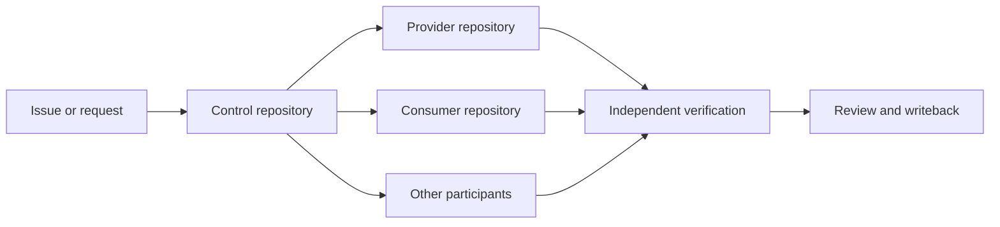

# Agentic Cross-Repository Harness

English | [简体中文](README.zh-CN.md)

Safely coordinate any coding agent across repositories, without coupling the workflow to an application language.

This project generates a lightweight **control repository** that makes cross-repository work explicit: which repositories an agent may change, who owns contract truth, how every repository is verified, and where execution can safely resume.

It is provider-neutral, generates adapters for Codex, Cursor, Claude Code, and GitHub Copilot,
uses only the Python standard library when run from source, and never modifies participant repositories during initialization.

## What you get

- an explicit registry of participating repositories and their responsibilities;
- an ExecPlan template that acts as a per-task write boundary;
- provider/consumer rules that prevent copied contracts from becoming competing truth;
- repository-local verification and rollback units;
- a read-only structural checker;
- thin coding-agent adapters backed by one canonical `AGENTS.md`;
- a doctor command that explains adapter and verification readiness;
- public-content scanning for common private-data indicators.

Repository verification commands are opaque strings, so participants can use Maven, Gradle, npm,
Go, Cargo, or any other repository-owned toolchain.

## Who it is for

Use this Harness when an AI-assisted change can span an API, frontend, generated client, infrastructure, documentation, or another independently owned repository.

It is especially useful for:

- platform and architecture teams coordinating several repositories;
- teams adopting Codex, Claude Code, Cursor, or other coding agents;
- provider/consumer systems that need clear contract ownership;
- long-running tasks that need durable recovery points and decision records.

It is probably unnecessary for a small task contained entirely within one repository.

## How it works



The operating sequence is:

```text
collect → gate → freeze → slice → implement
        → verify-<repo-id> → verify-integration
        → review → writeback → notify
```

The control repository coordinates work. It does not become a third copy of implementation or contract truth.

## Three-minute example

Requirements when running from source: Git and Python 3.10 or newer. No third-party Python packages are required.
Tagged releases are configured to publish standalone Windows, Linux, and macOS executables.

```bash
git clone https://github.com/tomcatlixiaoyao/agentic-cross-repo-harness.git
cd agentic-cross-repo-harness

python scripts/harness_cli.py init \
  --manifest examples/manifest.json \
  --target ../sample-product-harness \
  --tools auto \
  --dry-run

python scripts/harness_cli.py init \
  --manifest examples/manifest.json \
  --target ../sample-product-harness \
  --tools auto

python scripts/harness_cli.py check --root ../sample-product-harness
python scripts/harness_cli.py doctor --root ../sample-product-harness
```

Expected validation message:

```text
Harness validation passed
```

Doctor then reports each configured adapter and finishes with a structural-check result.

The generated control repository contains:

```text
sample-product-harness/
├── AGENTS.md
├── CLAUDE.md
├── README.md
├── repos.yaml
├── sample-product.code-workspace
├── .agents/
│   ├── PLANS.md
│   └── plans/
│       ├── TEMPLATE-cross-repo.md
│       └── TEMPLATE-register-repo.md
├── .cursor/rules/harness-control.mdc
├── .github/copilot-instructions.md
├── scripts/
│   ├── check_harness.py
│   ├── doctor_harness.py
│   └── harness_lib.py
├── contracts/INDEX.md
└── docs/harness/
    ├── inventory.md
    ├── verification.md
    └── PARTICIPANT_AGENTS_TEMPLATE.md
```

The initializer writes only inside `--target`. It does not edit `../sample-api`, `../sample-web`, or any other sibling.

`AGENTS.md` is the only authoritative agent policy. Claude imports it, while Cursor and Copilot
adapters point back to it. See [Coding-Agent Compatibility](docs/agent-tool-compatibility.md).

For Windows PowerShell instructions and a field-by-field manifest guide, see the [full quick start](docs/quick-start.md).

For a concrete contract change across a Java API provider and web consumer, follow the
[end-to-end example](examples/java-api-web/README.md). It includes a filled, pre-execution
ExecPlan, expected generated output, independent Maven/npm validation, and rollback boundaries.

Teams that already use a local code graph can also follow the optional
[Codebase Memory integration](docs/codebase-memory-integration.md). Structural analysis may
suggest impact, but it never grants Harness write authority.

## The safety boundary

For every cross-repository task, copy the generated ExecPlan template and list every registered repository:

```markdown
| Repository | Allowed paths | Excluded paths |
| --- | --- | --- |
| harness | .agents/plans/2026-08-31/example.md | all other paths |
| api | src/contracts/openapi.yaml | all other paths |
| web | none | all |
```

`none` means no write authority. A repository or path absent from the allowed column is not authorized for modification.

## Important guarantees

- Exactly one registered repository has role `control` and path `.`.
- Participants use explicit paths beneath the direct parent; absolute paths and parent traversal are rejected.
- The checker is read-only and never runs participant verification commands.
- Provider repositories own contract truth. Consumer snapshots do not replace it.
- Commits, verification, and rollback remain repository-local.
- Publishing, deployment, permission changes, deletion, and other external effects remain separately confirmed actions.

See [Concepts](docs/concepts.md) and the [Security Model](docs/security-model.md) for the rationale.

## Project status

Version `0.2.0` adds multi-agent-tool adapters, automatic adapter selection, a unified CLI, doctor diagnostics,
and portable executable build automation. It deliberately does not orchestrate deployments, merges,
issue trackers, or arbitrary commands across sibling repositories.

- [Roadmap](ROADMAP.md)
- [Changelog](CHANGELOG.md)
- [Contributing](CONTRIBUTING.md)
- [Security policy](SECURITY.md)

## Development

```bash
python -m unittest discover -s tests -p "test_*.py"
python scripts/scan_public.py --root .
```

## License

MIT. See [LICENSE](LICENSE).
