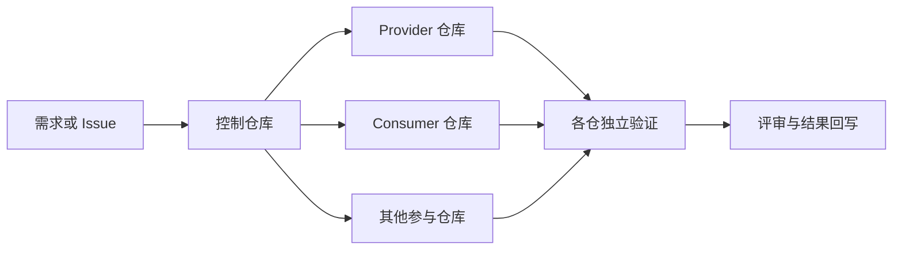

# Agentic Cross-Repository Harness

[English](README.md) | 简体中文

安全地协调 AI 编码智能体跨多个 Git 仓库工作。

本项目用于生成一个轻量级的**控制仓库（Control Repository）**，把跨仓任务中的关键边界写清楚：智能体可以修改哪些仓库、谁拥有契约真相、每个仓库如何独立验证，以及任务中断后从哪里安全恢复。

它不绑定特定 AI 工具，只依赖 Python 标准库，并且初始化时绝不会修改参与项目的仓库。

## 它解决什么问题

当一个 AI 任务同时涉及 API、前端、生成客户端、基础设施或文档仓库时，常见风险包括：

- 智能体修改了错误的仓库或未登记的目录；
- 消费方保存的快照反过来覆盖了提供方的契约真相；
- 多个仓库混在一个回滚单元中；
- 只运行一个仓库的测试，却宣称集成验证成功；
- 会话中断后，范围、决策、恢复点和下一步丢失。

Harness 将这些约束落成可审查的仓库文件和确定性检查。

## 你会得到什么

- 明确记录仓库职责的注册表；
- 作为单次任务写入边界的 ExecPlan 模板；
- 防止契约出现多份真相的 Provider/Consumer 规则；
- 每个仓库独立的验证和回滚单元；
- 不执行任何业务命令的只读结构校验器；
- 面向公开发布的常见敏感信息扫描器。

## 适合谁

当一次 AI 辅助变更可能跨越多个独立仓库时，建议使用本 Harness，例如：

- 需要协调多个仓库的平台或架构团队；
- 正在引入 Codex、Claude Code、Cursor 等编码智能体的团队；
- 需要明确 API 或数据契约归属的 Provider/Consumer 系统；
- 需要持续记录决策、恢复点和下一步的长任务。

如果任务始终只发生在一个小型仓库内，通常不需要引入它。

## 工作方式



标准流程为：

```text
收集 → 准入判断 → 冻结契约 → 拆分任务 → 实现
     → 各仓验证 → 集成验证 → 评审 → 回写 → 通知
```

控制仓库只负责协调，不复制业务实现，也不成为契约的另一份真相。

## 三分钟体验

前置条件：Git、Python 3.10 或更高版本。不需要安装第三方 Python 依赖。

```bash
git clone https://github.com/tomcatlixiaoyao/agentic-cross-repo-harness.git
cd agentic-cross-repo-harness

python scripts/init_harness.py \
  --manifest examples/manifest.json \
  --target ../sample-product-harness \
  --dry-run

python scripts/init_harness.py \
  --manifest examples/manifest.json \
  --target ../sample-product-harness

python ../sample-product-harness/scripts/check_harness.py \
  --root ../sample-product-harness
```

成功时最后会看到：

```text
Harness validation passed
```

生成结果如下：

```text
sample-product-harness/
├── AGENTS.md
├── README.md
├── repos.yaml
├── sample-product.code-workspace
├── .agents/
│   ├── PLANS.md
│   └── plans/
│       ├── TEMPLATE-cross-repo.md
│       └── TEMPLATE-register-repo.md
├── .cursor/rules/harness-control.mdc
├── scripts/
│   ├── check_harness.py
│   └── harness_lib.py
├── contracts/INDEX.md
└── docs/harness/
    ├── inventory.md
    ├── verification.md
    └── PARTICIPANT_AGENTS_TEMPLATE.md
```

初始化器只会写入 `--target`，不会修改 `../sample-api`、`../sample-web` 或其他兄弟仓库。

Windows PowerShell 命令和 manifest 字段说明请查看[完整快速开始](docs/quick-start.md)。

## 写入边界示例

每次跨仓任务都要复制生成的 ExecPlan 模板，并列出所有已注册仓库：

```markdown
| Repository | Allowed paths | Excluded paths |
| --- | --- | --- |
| harness | .agents/plans/2026-08-31/example.md | all other paths |
| api | src/contracts/openapi.yaml | all other paths |
| web | none | all |
```

`none` 表示没有写入权限。未出现在允许列中的仓库或路径，智能体不得修改。

## 重要安全保证

- 只能有一个角色为 `control`、路径为 `.` 的仓库；
- 参与仓库必须使用父目录下的显式相对路径，绝对路径和越级目录穿越会被拒绝；
- 校验器只读，不会执行参与仓库的验证命令；
- Provider 仓库拥有契约真相，Consumer 快照不能替代它；
- 提交、验证和回滚都保持仓库级独立；
- 发布、部署、权限变更、删除及其他外部副作用仍需独立确认。

设计原因请查看[核心概念](docs/concepts.md)和[安全模型](docs/security-model.md)。

## 项目状态

`0.1.0` 是可以运行的公开基础版本，已经具备确定性生成、结构校验、测试和敏感信息扫描。它目前不会自动执行部署、合并 PR、操作 Issue 系统或跨仓运行任意命令。

- [路线图](ROADMAP.md)
- [版本记录](CHANGELOG.md)
- [参与贡献](CONTRIBUTING.md)
- [安全策略](SECURITY.md)

## 本地开发验证

```bash
python -m unittest discover -s tests -p "test_*.py"
python scripts/scan_public.py --root .
```

## 开源协议

MIT，详见 [LICENSE](LICENSE)。
